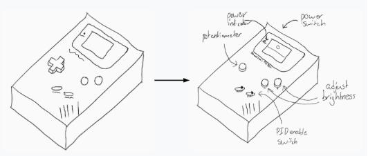

# PID_GameBoy
Bob and Liam's PID Box in the form of a GameBoy!
## Table of Contents
- [Planning](#planning)
  - [Description](#description)
  - [Criteria](#criteria)
  - [Constraints](#constraints)
  - [Possible Solutions](#possible-solutions)
  - [Sketches](#sketches)
  - [List of Materials](#list-of-materials)
  - [Schedule](#schedule)
- [Documentation](#documentation)
  - [CAD](#cad)
  - [Code Planning](#code-planning)
  
## Planning

  - [Description](#description)
  - [Criteria](#criteria)
  - [Constraints](#constraints)
  - [Possible Solutions](#possible-solutions)
  - [Sketches](#sketches)
  - [List of Materials](#list-of-materials)
  - [Schedule](#schedule)

[Back to ToC](#table-of-contents)

### Description
[Back to ToC](#table-of-contents)

Our initial plan for our PID box is to make it in the shape of a Nintendo Gameboy, and model the design after it. The dimensions will be the same as the Gameboy but with twice (thrice if needed) the depth to make room for the Arduino + backpack, breadboard, LCD + backpack, motor, and battery pack. As our LCD screen doesn’t have the same proportions as the Gameboy screen, we’ll put it at the bottom half of the Gameboy screen and have the rest be made of clear acrylic to see the wheel inside the box, which will poke out of the left side. We’ll also replace all of the original Gameboy controls with our own: the power switch will still be a power switch, the battery light will be our power indicator, the D-Pad will be the potentiometer, the A and B keys will be buttons to adjust the brightness of the screen, the start button will be the PID enable switch, and the select button will turn on the LED behind the wheel.

### Criteria
[Back to ToC](#table-of-contents)

- LCD screen to display RPM and other info
- Power switch & indicator
- PID enable switch
- Potentiometer to control the wheel
- Wheel connected to motor that breaks a photo interrupter beam
- LED that blinks when the photo interrupter beam is broken
- PID feedback system that corrects errors

- Documentation with:
  - Materials used
  - SolidWorks renderings
  - Actual photos and/or video (well lit and in focus)
  - Fritzing diagram of our circuit
  - Commented code
  - Description of the planning that went into the project, design decisions, and engineering details
  - A schedule of how you spent your time
  - Discussion of problems, errors, miscalculations, and missteps and how we overcame them

### Constraints

[Back to ToC](#table-of-contents)

1. We realized that it might be difficult or even impossible to keep the size & proportions of an actual Gameboy and fit everything (arduino, motor, lcd, wheel, etc) inside the box.
2. We also realized that our LCD screen is nowhere near the Gameboy’s screen in terms of proportions; our screen is about half the height and is slightly longer.

### Possible Solutions

[Back to ToC](#table-of-contents)

1. We could solve this by keeping the length and width dimensions and proportions, but double the depth. This would keep it a similar overall size to a Gameboy, and while it would be noticeably thicker, it wouldn’t be too big and would still be recognizable as a Gameboy.
2. To solve this, we decided to have the top half of the Gameboy screen as clear acrylic on our box, and the bottom half as the LCD screen without the sides showing. This acts as a window where you can see the wheel spinning, and there will be an LED behind the clear acrylic that acts as both a backlight and the LED that blinks when the wheel breaks the photointerrupter beam.

### Sketches

[Back to ToC](#table-of-contents)



### List of Materials
- Arduino
- Breadboard
- Motor
- LED x3
- Switches x3
- Wires 
- Resistors
- Acrylic
- #4-40 socket head screws and nuts
- T-Slots
- Battery
- Battery holder
- LCD screen & backpack
### Schedule
Nov 1: Planning completed

Nov 8 - Nov 26: Engineering Notebook\
Nov 27 - Dec 1: Thanksgiving Break\
Dec 6: Basic CAD outline completed\
Dec 13: T-slots and holes for switches and buttons completed\
\*Dec 17 - Dec 20: Midterms\
\*Dec 23 - Jan 5: Winter Break\
Jan 10: Screen assembly completed\
Jan 17: CAD finished\
Jan 24: Wiring completed\
Feb 7: Code completed\
Feb 14: Assembly finished, project done & submitted
## Documentation
**WARNING! This is a work in progress. Please pardon our dust XD**

### CAD

Bob found a model of a gameboy and made a rough draft to see if everything could fit in it. We realized there wasn't enough space, so we made it thicker. Next, Bob made the front face of our gameboy including the screen and holes for buttons and the potentiometer. Liam used the dimensions to make the outer shell of the box including t-slots so it all fit together. Liam then made the wheel part as well as the case for the motor and photointerrupter, so it would be easy to attach it wherever we end up deciding it should go.

1-22-2020

Bob fixed up the motor case subassembly, adding thicker attachments where needed and reducing overall size. He also added the slots in the motor case. 

1-23-2020

Bob added a hole to the motor case where the led will go. It will be behind the wheel part so it flickers as the wheel turns, and will be visible from the screen. He also made the holes in the top part of the box where the wheel will poke out as well as the holes to mount the motor and photointerrupter case.

1-24-2020

Bob created and attached the LCD mount

1-29-2020

Liam added the holes on the side parts

1-30-2020

Liam created and attached the Arduino mount

### Code Planning

Log Date, 1-8-2020

Coding this might honestly be either really confusing, or really ez. As I see it, there are a lot of things we will need for this:

- All of the buttons and switches and knobs consistently working as intended and quickly

- Automatic feedback loop working without interfering with everything else

- something else oh boy


Let's just figure out how we're gonna read the rpm

Thankfully we have [this text document](Media/PIDStepsForRPM.txt) from Mr. someone:

>This is to FIND AND VIEW the speed of your wheel, not to control the PID
>You'll control the PID after this step.

>//make a variable to act as a time point (oldTime)

>//compare that variable to the current time (use "millis()" )

>//use an IF to see if the time has been more than x milliseconds (1000 is an easy number to start with)

>//inside the IF, you want to DETACH the interupts, do a little math to find RPM   (photocount / time = rpm)

>// lcd.print out the rpm's and any other data you need

>//once you have rpm, you want to reset photocount to 0, and oldTime to the new time (again, use millis()  )

>//re-attach the interupts

>// end the if }

OK that's sorta helpful ok

Log Date: 1-9-2020

first off, what's RPM?

Rotations / Minutes 

ok, and we detect it using holes

every quadrant is equidistant, so lets have a 

``` arduino
#define NUM_OF_HOLES //#ofHoles
//multipy by 2 bc its whenever it changes
```
We're measuring in milliseconds, so to calc, we take
2n / m, then * 1000 to convert it to rpm

i THINK that's right but idk how to confirm it or test it

oh i forgot minute so * 60

okokok

so a function to detect the Time

``` arduino
#define PHOTO_PIN 2 //either 2 or 3

long oldTime = 0;
long time = 0;

void checkTime()
{

}
void setup() {
  Serial.begin(9600);
  pinMode(PHOTO_PIN, INPUT_PULLUP);

  attachInterrupt(digitalPinToInterrupt(PHOTO_PIN), checkTime, CHANGE);
    /*
      These functions are very funky.
      First off, use digitalPinToInterrupt() so you don't have to convert pins
      Remember that a pin can only watch one thing at a time
      And make functions that take nothing and return nothing
    */
}

```
oh wait he's saying not to do that, but instead
``` arduino
#define PHOTO_PIN 2 //either 2 or 3

long oldTime = 0;
long time = 0;
long rpm;
int photoCount = 0;

void check()
{
  ++photoCount;
}

void setup() {
  Serial.begin(9600);
  pinMode(PHOTO_PIN, INPUT_PULLUP);

  attachInterrupt(digitalPinToInterrupt(PHOTO_PIN), check, CHANGE);
    /*
      These functions are very funky.
      First off, use digitalPinToInterrupt() so you don't have to convert pins
      Remember that a pin can only watch one thing at a time
      And make functions that take nothing and return nothing
    */
}

void loop(){
  time = millis();
  if(time-oldTime > 1000)
  {
    detachInterrupt(digitalPinToInterrupt(PHOTO_PIN));

    rpm = photoCount/(time-oldTime);
    lcd.setCursor(0,1); //sets pos to print to
    //0,0 is the very top left. (Column[0-15], row[0-1])
    lcd.print(rpm);
    photoCount = 0;
    oldTime = millis();
    attachInterrupt(digitalPinToInterrupt(PHOTO_PIN), check, CHANGE);
  }
  
}

```
basically, count, and have time as constant

References:

* [detachInterrupt()](https://www.arduino.cc/reference/en/language/functions/external-interrupts/detachinterrupt/)
